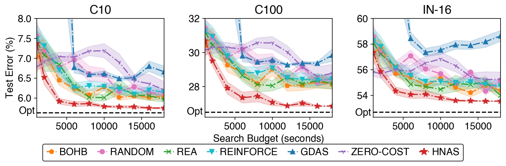

# Unifying and Boosting Gradient-based Training-Free Neural Architecture Search

This repository is the official implementation of [Unifying and Boosting Gradient-based Training-Free Neural Architecture Search](), which is based on the implementation of [Zero-Cost Proxies for Lightweight NAS](https://github.com/SamsungLabs/zero-cost-nas).

## Requirements

- [tensorboardX]()
- [Pytorch v1.6 or later](https://pytorch.org)
- [Bayesian Optimization package](https://github.com/fmfn/BayesianOptimization)
- [NAS-Bench-101](https://github.com/google-research/nasbench)
- [NAS-Bench-201](https://github.com/D-X-Y/NAS-Bench-201)

## Preparing Data and Training-free Metrics
### For NAS-Bench-101
1. Download the [`data` directory](https://drive.google.com/drive/folders/18Eia6YuTE5tn5Lis_43h30HYpnF9Ynqf?usp=sharing) and save it to the root folder of this repo. This contains pre-cached info from the NAS-Bench-101 repo.
2. [Optional] Download the [NAS-Bench-101 dataset](https://storage.googleapis.com/nasbench/nasbench_only108.tfrecord) and put in the `data` directory in the root folder of this project and also clone the [NAS-Bench-101 repo](https://github.com/google-research/nasbench) and install the package.
3. Run `python nasbench1_pred.py`. Note that this takes a long time to go through ~400k architectures.

### For NAS-Bench-201
1. Download the [NAS-Bench-201 dataset](https://drive.google.com/open?id=1SKW0Cu0u8-gb18zDpaAGi0f74UdXeGKs) and put in the `data` directory in the root folder of this project.
2. Run python `nasbench2_pred.py` with the appropriate cmd-line options -- a pickle file is produced with zero-cost metrics (or accuraies of architectures).
3. Note that you need to manually download [ImageNet16](https://drive.google.com/drive/folders/1NE63Vdo2Nia0V7LK1CdybRLjBFY72w40?usp=sharing) and put in `_datasets/ImageNet16` directory in the root folder. CIFAR-10/100 will be automatically downloaded.

## Search

To conduct the architecture search on NAS-Bench-201 with different training-free metrics (completed with only cpu), run these commands:

```bash
PYTHONPATH=$PWD python nasbench/nasbench2_search.py --metric ntk_trace --seed 0
PYTHONPATH=$PWD python nasbench/nasbench2_search.py --metric grad_norm --seed 0
PYTHONPATH=$PWD python nasbench/nasbench2_search.py --metric snip --seed 0
PYTHONPATH=$PWD python nasbench/nasbench2_search.py --metric grasp --seed 0
```

To conduct the architecture search in the DARTS search space with different datasets (requiring GPU and only using training-free metric ntk trace norm), run these commands:

```bash
PYTHONPATH=$PWD python darts_space/search.py --dataset cifar10 # search on cifar10
PYTHONPATH=$PWD python darts_space/search.py --dataset cifar100 # search on cifar100
PYTHONPATH=$PWD python darts_space/search.py --dataset imagenet --data /path/to/imagenet/dataset/ --epochs 3 --total_iters 10 --n_sample 60000 --seed 0 --drop_path_prob 0.0 --learning_rate 1 --train_portion 0.25 --batch_size 800 # search on imagenet
```

## Training
To train the model on CIFAR-10/100/ImageNet in the paper, run these commands, respectively:

```bash
# Train on CIFAR-10
python darts_space/train_cifar.py --auxiliary --cutout --arch arch_name --save log_name --data path/to/cifar10/data/ --dataset cifar10 --learning_rate 0.025 --auxiliary_weight 0.4 --drop_path_prob 0.2 
# Train on CIFAR-100
python darts_space/train_cifar.py --auxiliary --cutout --arch arch_name --save log_name --data path/to/cifar100/data/ --dataset cifar100 --learning_rate 0.035 --learning_rate_min 0.001 --auxiliary_weight 0.6 --drop_path_prob 0.3
# Train on ImageNet
CUDA_VISIBLE_DEVICES=0,1,2,3,4,5,6,7 python -m torch.distributed.launch --nproc_per_node=8 --master_port 30408 train_imagenet.py --arch arch_name --save log_name --auxiliary --data_dir path/to/imagenet/data/
```

## Results
Our search results on NAS-Bench-201 (mainly compared with query-based NAS methods):



## Citation
```
@inproceedings{
    shu2022unifying,
    title={Unifying and Boosting Gradient-Based Training-Free Neural Architecture Search},
    author={Yao Shu and Zhongxiang Dai and Zhaoxuan Wu and Bryan Kian Hsiang Low},
    booktitle={Advances in Neural Information Processing Systems},
    editor={Alice H. Oh and Alekh Agarwal and Danielle Belgrave and Kyunghyun Cho},
    year={2022},
    url={https://openreview.net/forum?id=TC42kAO8XLS}
}
```